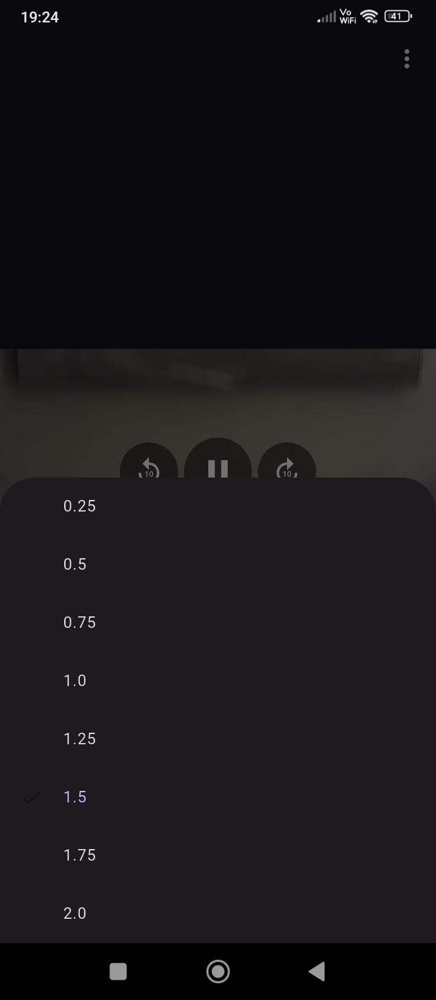
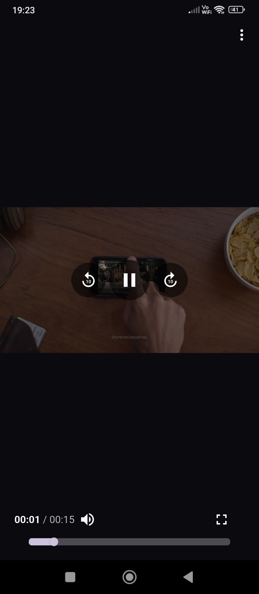
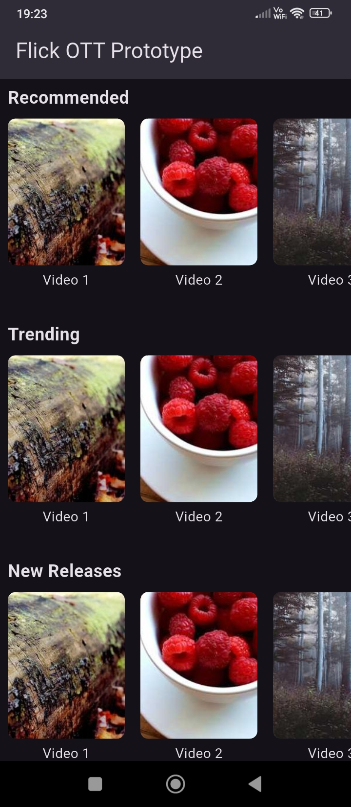
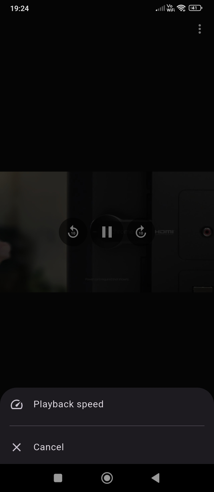
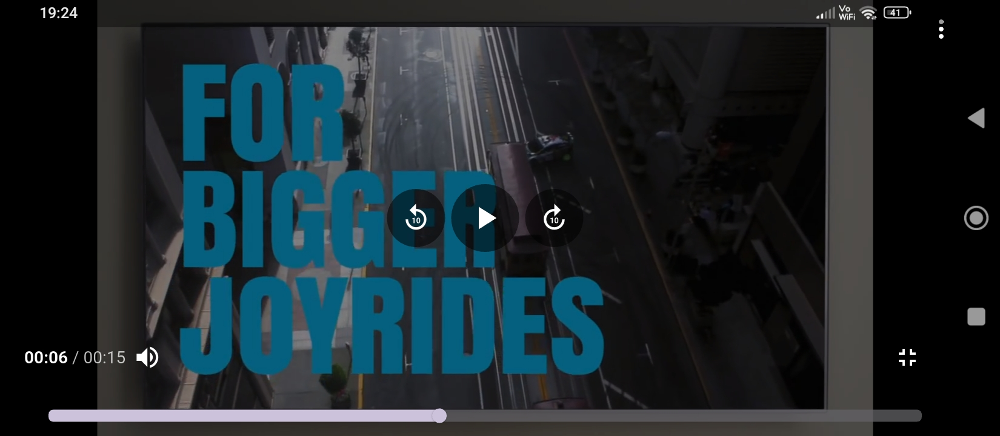

# ott_prototype
A new Flutter project — an OTT-style video streaming prototype.

## Overview
This Flutter app displays a carousel of videos with thumbnails, allowing users to tap and play videos using an in-app video player.

## Getting Started

To build and run this project locally, follow these steps:
## 1. Clone the repository
git clone
cd ott_prototype

## Output
<table>
  <tr>
    <td></td>
    <td></td>
    <td></td>
  </tr>
  <tr>
    <td></td>
    <td></td>
    <td></td>
  </tr>
</table>

